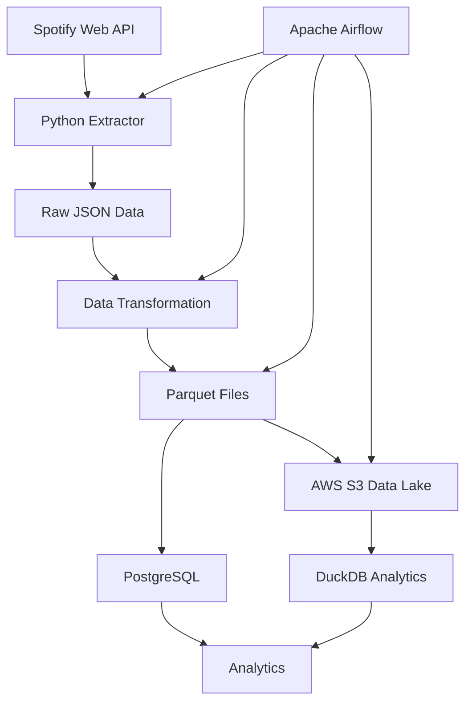

# 🎵 Spotify Data Engineering Platform

<p align="center">


</p>

---

# 📌 Overview

The **Spotify Data Engineering Platform** is a cloud-ready, end-to-end data engineering project that automatically extracts music metadata from the Spotify Web API, transforms raw JSON into analytics-ready datasets, stores data in PostgreSQL, uploads Parquet files to Amazon S3, and orchestrates the complete workflow using Apache Airflow.

The project demonstrates modern data engineering concepts including API ingestion, ETL pipelines, workflow orchestration, cloud storage, Parquet processing, and data lake architecture.

---

# 🏗 Architecture



---

# 🚀 Features

- Spotify Web API Integration
- Multi-Artist Data Extraction
- Automated ETL Pipeline
- Raw JSON Data Lake
- Data Transformation
- Parquet File Generation
- PostgreSQL Storage
- AWS S3 Cloud Storage
- DuckDB Analytics
- Apache Airflow Orchestration
- Dockerized Infrastructure
- Modular Project Architecture
- Cloud-Ready Design

---

# 🛠 Technology Stack

| Category | Technology |
|-----------|------------|
| Programming Language | Python |
| API | Spotify Web API |
| Workflow Orchestration | Apache Airflow |
| Database | PostgreSQL |
| Cloud Storage | AWS S3 |
| Analytics | DuckDB |
| File Format | Parquet |
| Containerization | Docker |
| Version Control | Git + GitHub |

---

# 📂 Project Structure

```text
spotify-data-engineering-platform/

airflow/
│
├── dags/
├── logs/
└── plugins/

api/
│
├── spotify_client.py
├── spotify_service.py
├── extract.py
└── save_json.py

config/

data/
│
├── raw/
├── processed/
└── parquet/

docker/

docs/
│
└── images/

etl/
│
├── transform.py
├── parquet.py
├── load.py
└── pipeline.py

lake/
│
├── duckdb_loader.py
├── s3_upload.py
└── queries.py

metadata/

tests/

utils/

warehouse/

README.md

docker-compose.yml

requirements.txt
```

---

# 📊 Data Pipeline

```text
Spotify Web API

↓

Python Extractor

↓

Raw JSON

↓

Transform

↓

Parquet

↓

AWS S3

↓

PostgreSQL

↓

DuckDB

↓

Analytics
```

---

# ☁ AWS Architecture

```text
Spotify API

↓

Raw JSON

↓

Parquet

↓

Amazon S3

↓

DuckDB

↓

Analytics
```

---

# 🔄 ETL Workflow

```text
Spotify API

↓

Extract

↓

Transform

↓

Generate Parquet

↓

Upload to AWS S3

↓

Load PostgreSQL

↓

Analytics

↓

Complete
```

---

# 🌊 Apache Airflow Pipeline

```text
Start

↓

Extract Spotify Data

↓

Transform Data

↓

Generate Parquet

↓

Upload to AWS S3

↓

Load PostgreSQL

↓

Finish
```

---

# 📦 Data Lake

The project stores analytics-ready Parquet files in Amazon S3.

Example structure:

```text
spotify-data-lake/

raw/

processed/

parquet/
    albums.parquet
```

---

# 🗄 PostgreSQL

Example tables:

```text
albums
```

Future warehouse expansion:

```text
dim_artist

dim_album

dim_track

fact_tracks
```

---

# 📈 DuckDB Analytics

Example analytics:

- Albums by Release Year
- Albums per Artist
- Total Tracks per Album
- Album Release Trends
- Artist Catalog Statistics

---

# 🐳 Docker Services

The platform runs inside Docker.

Containers:

- PostgreSQL
- Apache Airflow Scheduler
- Apache Airflow Webserver

---

# 🚀 Getting Started

## Clone Repository

```bash
git clone https://github.com/jaypatel17486/spotify-data-engineering-platform.git

cd spotify-data-engineering-platform
```

---

## Install Dependencies

```bash
python -m venv .venv

source .venv/bin/activate

pip install -r requirements.txt
```

---

## Start Docker

```bash
docker compose up -d
```

---

## Run ETL Pipeline

```bash
python -m etl.pipeline
```

---

## Open Airflow

```
http://localhost:8085
```

---

# 📸 Project Screenshots

## 🌊 Apache Airflow Workflow

The ETL pipeline is orchestrated using Apache Airflow.

<p align="center">
  
</p>

---

## ☁️ AWS S3 Data Lake

Parquet datasets are automatically uploaded to Amazon S3.

<p align="center">
  
</p>
---

## 🦆 DuckDB Analytics

DuckDB performs analytical queries directly on Parquet files.

<p align="center">
  
</p>

---

## 🏗 Architecture

<p align="center">
  
</p>

---

# 🔍 Future Improvements

- Snowflake Integration
- AWS Glue
- AWS Athena
- dbt Transformations
- GitHub Actions CI/CD
- Great Expectations Data Validation
- Grafana Monitoring
- Slack Notifications

---

# 🎯 Learning Outcomes

This project demonstrates experience with:

- REST API Integration
- ETL Pipeline Development
- Data Transformation
- Apache Airflow
- PostgreSQL
- AWS S3
- DuckDB
- Parquet
- Docker
- Cloud Data Engineering
- Data Lake Architecture

---

# 👨‍💻 Author

**Jay Patel**

Computer Science Student

Aspiring Data Engineer

📍 Northridge, California

---

# 📜 License

This project is licensed under the MIT License.
